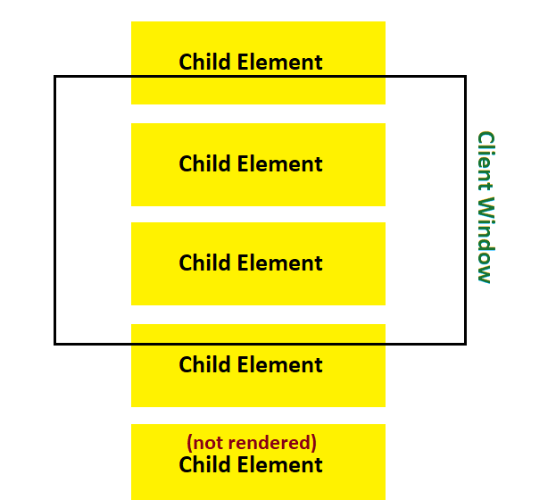

# Virtual Scroll Component 

Virtual and infinite scrolling for a list of elements. 
A wrapper component to be used in the [React](https://reactjs.org/) framework.

- [Motivation](#motivation)
- [Installation](#installation)
- [Usage](#usage)
- [Pitfalls](#pitfalls)
- [Development](#development)
- [Acknowledgement](#acknowledgement)

## Motivation
Rendering hundreds of elements in DOM can be slow,
especially if your elements are non-trivial. Instead, we can
simply render elements as necessary when they are scrolled into view. This is called **virtual scrolling**. 



As you can imagine, rendering only view-able elements can cause 
unnecessary document scrolling as the position of HTML elements are usually relative.
We can fix this by wrapping a container with fixed height around every element, and only render the child element when necessary.
## Installation 
Install through [npm](https://www.npmjs.com/get-npm) or [yarn](https://classic.yarnpkg.com/en/docs/getting-started).
```shell script
npm install virtual-scroll-component 
```
```shell script
yarn add virtual-scroll-component
```

## Usage 
```js
import VirtualScroll from 'virtual-scroll-component';
```

## Props

### rows
Use **rows** to pass an array of component instances to be placed in a virtualized scroll
container. This can also be done with **props.children**, but do
note that any arguments passed to **props.children** takes precedence over 
**rows**. 

```js
<VirtualScroll rows={[<div/>, <div/>]}/>
```

```js
<VirtualScroll rows={[<span/>]}>
    <div/> // div will be used, and not span
</VirtualScroll>
```

### rowHeight 
Use **rowHeight** to set the height of each row. Accepts an integer and is interpreted in CSS pixels. 

```js
<VirtualScroll rowHeight={100}/> 
```

### onLastRow 
Use **onLastRow** to set a function to be called every time the last row is in view. 
You can pass a function which increases the number of component instances, thereby creating an infinite scroll. 

```js
const [rows, setRows] = useState([<Child/>]);
const handleLastRow = () => {
    setRows([...rows, <Child/>])
}

return (<VirtualScroll rows={rows} onLastRow={handleLastRow}/>);
```

### className 
Use **className** to add a CSS class onto the VirtualScroll component.
By default, elements are rendered vertically. Use **className** to override default styles. 
```js
<VirtualScroll className={"custom-class-name"}/>
```

### props.children 
Use **props.children** to pass a list of component instances to be placed in a virtualized scroll
container. This can also be done with **rows**, but do
note that any arguments passed to **props.children** takes precedence over **rows**. 

```js
<VirtualScroll>
    <div/>
    <div/>
</VirtualScroll>
```

### Pitfalls 

This package does not support elements with varying heights.

### Development
There are some scripts available in package.json. 

- `yarn start` - to watch for file changes and update automatically with webpack
- `yarn build` - to build the package and store in ./dist/index.js 
- `yarn jest` - to run unit tests 

I welcome any from of participation, so feel free to submit an [issue](https://github.com/alvinnguyen116/Virtual-Scroll-Component/issues) or make a 
[pull request](https://github.com/alvinnguyen116/Virtual-Scroll-Component/pulls). 

### Acknowledgement
Big thanks to [BP mishra](https://github.com/bindhyeswari) for his guidance throughout this project!

